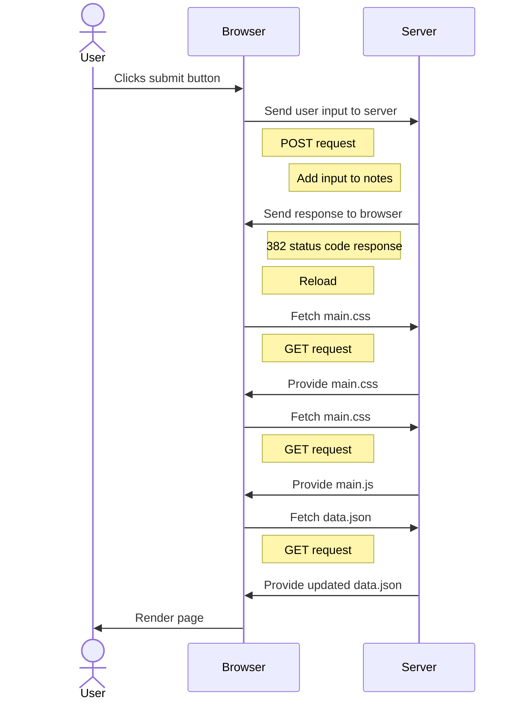

```mermaid
sequenceDiagram
    actor User
    
    User->>Browser: Clicks submit button
    Browser->>Server: Send user input to server
    Note right of Browser: POST request
    Note left of Server: Add input to notes
    Server->>Browser: Send response to browser
    Note left of Server: 382 status code response
    Note right of Browser: Reload
    Browser->>Server: Fetch main.css
    Note right of Browser: GET request
    Server->>Browser: Provide main.css
    Browser->>Server: Fetch main.css
    Note right of Browser: GET request
    Server->>Browser: Provide main.js
    Browser->>Server: Fetch data.json
    Note right of Browser: GET request
    Server->>Browser: Provide updated data.json
    Browser->>User: Render page

```