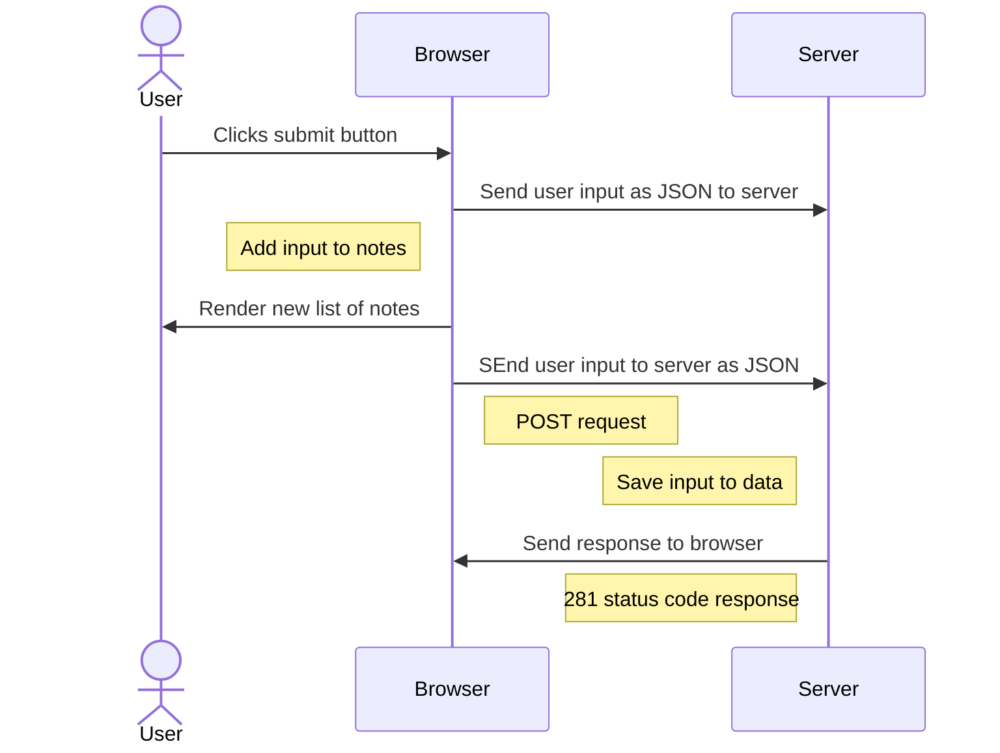

```mermaid
sequenceDiagram
    actor User

    User->>Browser: Clicks submit button
    Browser->>Server: Send user input as JSON to server
    Note left of Browser: Add input to notes
    Browser->>User: Render new list of notes
    Browser->>Server: SEnd user input to server as JSON
    Note right of Browser: POST request
    Note left of Server: Save input to data
    Server->>Browser: Send response to browser
    Note left of Server: 281 status code response
```